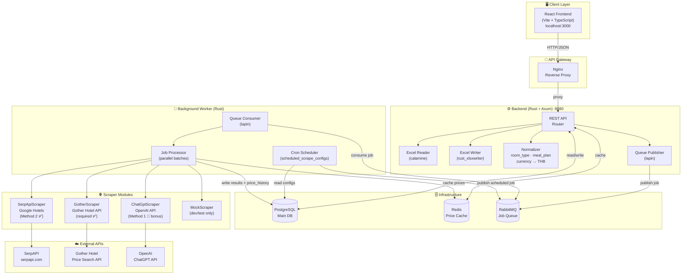
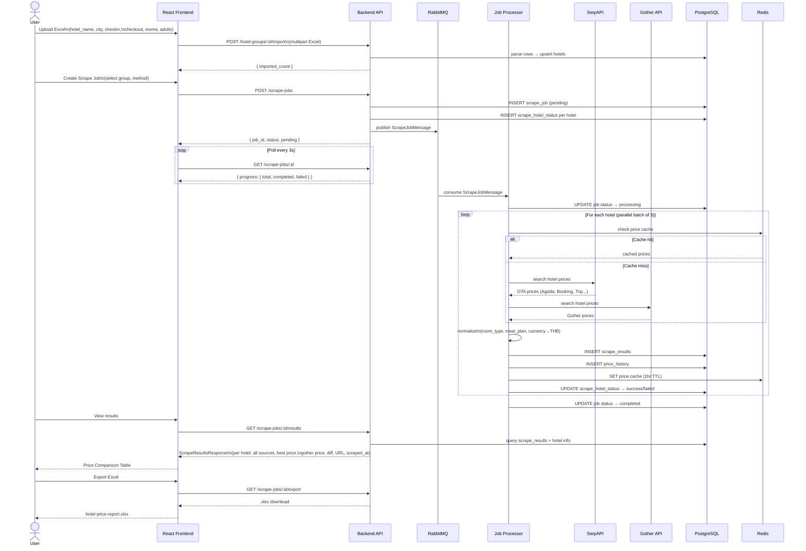
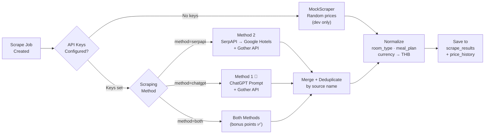
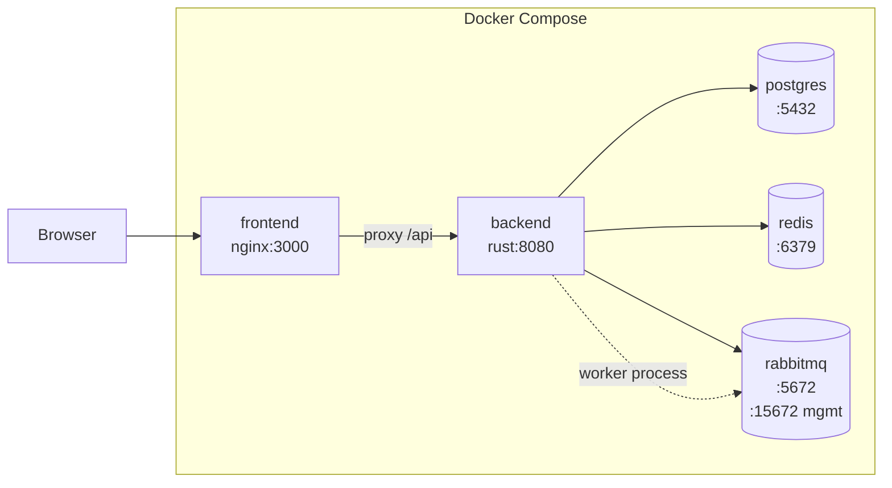

# System Architecture v1

## Component Overview

---

## Data Flow — Competition Demo Path

---

## Scraper Strategy

---

## Deployment Architecture

---

## Key Design Decisions

| Decision | Choice | Reason |
|----------|--------|--------|
| Backend language | Rust + Axum | Performance, safety, competition differentiator |
| Async job processing | RabbitMQ | Decouples slow scraping from HTTP response |
| Price cache | Redis | Avoid redundant API calls within 1-hour window |
| Scraping: OTA | SerpAPI (Google Hotels) | Aggregates Agoda, Booking, Trip.com in one call |
| Scraping: Gother | Gother internal API | Required by competition |
| Scraping: Bonus | ChatGPT (OpenAI) | Method 1 — bonus points |
| Data persistence | PostgreSQL | Single store for all data; sufficient for competition scale |
| History table | Partitioned by month | Scale: 1M+ rows/year without performance loss |
| Concurrency | 3 hotels parallel | Balance speed vs. API rate limits |

---

## Decisions

| Decision | Answer |
|----------|--------|
| `ScrapingMethod` stored in DB | ✅ Yes — `scrape_jobs.method` column. Persisted so results always show which method was used |
| ChatGPT response format | ✅ Prompt requests strict JSON (`ChatGptHotelPriceJson` schema). No free-text parsing |
| Method 1 + 2 results display | ✅ Merged into one comparison table, deduplicated by source name |

## Open Questions
> [!WARNING]
> Still unresolved — must answer before implementation.

- [ ] What is the Gother Hotel Room Price Search API endpoint and auth method? → **Pending** — internal API docs to be supplied separately before GotherScraper implementation.
- [x] Does ChatGPT (Method 1) call TripAdvisor internally, or do we call TripAdvisor separately? → Resolved: **ChatGPT calls TripAdvisor internally** as part of its own lookup. We do not integrate TripAdvisor API directly.
- [x] Should we integrate TripAdvisor API directly as an OTA source? → Resolved: **No** — out of scope for Phase 1.
- [ ] Rate limits on SerpAPI plan — how many requests/day? → **Pending** — need to check account dashboard before setting `WORKER_CONCURRENCY` and scheduled run frequency.

## Change Log
| Version | Date | Change |
|---------|------|--------|
| 1.0 | 2026-04-27 | Initial draft — competition submission architecture |
