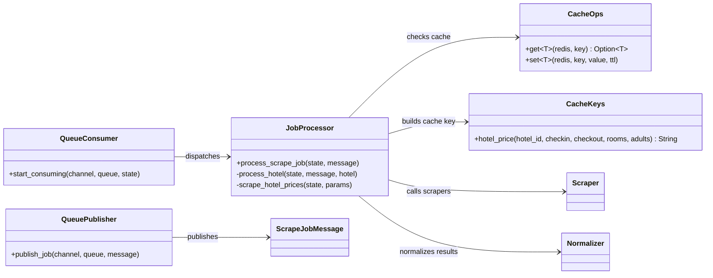
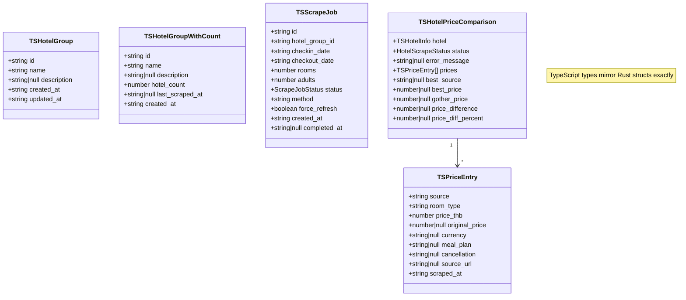

# Class Diagram v1

## Domain Model

```mermaid
classDiagram
    direction TB

    %% ─── Enums ───────────────────────────────────────────────
    class ProductType {
        <<enumeration>>
        hotel
        experience
        flight
    }

    class ScrapeJobStatus {
        <<enumeration>>
        pending
        processing
        completed
        failed
        cancelled
    }

    class HotelScrapeStatus {
        <<enumeration>>
        pending
        processing
        success
        failed
    }

    class ScrapingMethod {
        <<enumeration>>
        serpapi
        chatgpt
        both
        mock
    }

    %% ─── Hotel Domain ────────────────────────────────────────
    class HotelGroup {
        +UUID id
        +String name
        +String? description
        +DateTime created_at
        +DateTime updated_at
    }

    class Hotel {
        +UUID id
        +String name
        +String city
        +String country
        +String normalized_name
        +DateTime created_at
        +DateTime updated_at
        +normalize_name(name) String
    }

    class HotelGroupMember {
        +UUID id
        +UUID hotel_group_id
        +UUID hotel_id
        +DateTime created_at
    }

    %% ─── Job Domain ──────────────────────────────────────────
    class ScrapeJob {
        +UUID id
        +UUID hotel_group_id
        +Date checkin_date
        +Date checkout_date
        +i32 rooms
        +i32 adults
        +ScrapeJobStatus status
        +ScrapingMethod method
        +bool force_refresh
        +DateTime created_at
        +DateTime? completed_at
    }

    class ScrapeHotelStatus {
        +UUID id
        +UUID scrape_job_id
        +UUID hotel_id
        +HotelScrapeStatus status
        +i32 retry_count
        +String? error_message
        +DateTime created_at
        +DateTime updated_at
    }

    class ScrapeProgress {
        +i32 total
        +i32 completed
        +i32 failed
        +i32 pending
    }

    class ScrapeJobMessage {
        +UUID job_id
        +UUID hotel_group_id
        +Date checkin_date
        +Date checkout_date
        +i32 rooms
        +i32 adults
        +ScrapingMethod method
        +bool force_refresh
    }

    %% ─── Result Domain ───────────────────────────────────────
    class ScrapeResult {
        +UUID id
        +UUID scrape_job_id
        +UUID hotel_id
        +String source
        +String room_type
        +f64 price_thb
        +f64? original_price
        +String? currency
        +String? meal_plan
        +String? cancellation
        +String? source_url
        +DateTime scraped_at
    }

    class PriceEntry {
        +String source
        +String room_type
        +f64 price_thb
        +f64? original_price
        +String? currency
        +String? meal_plan
        +String? cancellation
        +String? source_url
        +DateTime scraped_at
    }

    class HotelPriceComparison {
        +HotelInfo hotel
        +HotelScrapeStatus status
        +String? error_message
        +PriceEntry[] prices
        +String? best_source
        +f64? best_price
        +f64? gother_price
        +f64? price_difference
        +f64? price_diff_percent
    }

    class ScrapeResultsResponse {
        +ScrapeJobInfo job
        +ScrapeResultsSummary summary
        +HotelPriceComparison[] results
    }

    %% ─── Currency Domain ─────────────────────────────────────
    class CurrencyExchangeRate {
        +UUID id
        +String from_currency
        +String to_currency
        +Decimal rate
        +Date rate_date
        +String source
        +DateTime created_at
        +get_rate(from, to, date) CurrencyExchangeRate
        +fetch_and_store(from, to, date) CurrencyExchangeRate
    }

    class RateSource {
        <<enumeration>>
        BOT
        exchangerate_api
        manual
        fallback
    }

    %% ─── History Domain (product-specific) ───────────────────
    class HotelPriceHistory {
        +UUID id
        +UUID hotel_id
        +String source
        +String room_type
        +Decimal price_thb
        +Decimal original_price
        +String currency
        +UUID exchange_rate_id
        +String? meal_plan
        +String? cancellation
        +String? source_url
        +Date checkin_date
        +Date checkout_date
        +i32 rooms
        +i32 adults
        +UUID? scrape_job_id
        +DateTime scraped_at
    }

    class ExperiencePriceHistory {
        +UUID id
        +UUID experience_id
        +String source
        +String activity_name
        +Decimal price_thb
        +Decimal original_price
        +String currency
        +UUID exchange_rate_id
        +Date activity_date
        +i32 adults
        +f32? duration_hours
        +String? inclusions
        +String? source_url
        +DateTime scraped_at
    }

    class FlightPriceHistory {
        +UUID id
        +UUID route_id
        +String source
        +String airline
        +String cabin_class
        +Decimal price_thb
        +Decimal original_price
        +String currency
        +UUID exchange_rate_id
        +Date departure_date
        +Date? return_date
        +i32 adults
        +String? source_url
        +DateTime scraped_at
    }

    class ScheduledScrapeConfig {
        +UUID id
        +UUID hotel_group_id
        +String? name
        +String cron_expression
        +i32[] lookahead_days
        +i32 rooms
        +i32 adults
        +bool is_active
        +DateTime? last_run_at
        +DateTime? next_run_at
        +DateTime created_at
        +DateTime updated_at
    }

    %% ─── Scraper Interface + Implementations ─────────────────
    class Scraper {
        <<interface>>
        +name() String
        +scrape(params ScrapeParams) Result~Vec~ScrapeResult~~
    }

    class ScrapeParams {
        +String hotel_name
        +String city
        +String country
        +Date checkin_date
        +Date checkout_date
        +i32 rooms
        +i32 adults
    }

    class SerpApiScraper {
        -String api_key
        -String base_url
        -HttpClient client
        +new(api_key) SerpApiScraper
        +scrape(params) Result~Vec~ScrapeResult~~
        -normalize_source(source) String
    }

    class GotherScraper {
        -String api_url
        -String api_key
        -HttpClient client
        +new(api_url, api_key) GotherScraper
        +scrape(params) Result~Vec~ScrapeResult~~
    }

    class ChatGptScraper {
        -String api_key
        -String model
        -HttpClient client
        +new(api_key) ChatGptScraper
        +scrape(params) Result~Vec~ScrapeResult~~
        -build_prompt(params) String
        -parse_json_response(json) Result~Vec~ScrapeResult~~
    }

    class ChatGptHotelPriceJson {
        +String hotel_name
        +String checkin_date
        +String checkout_date
        +ChatGptPriceItem[] results
    }

    class ChatGptPriceItem {
        +String source
        +String room_type
        +f64 price_thb
        +f64 original_price
        +String currency
        +String meal_plan
        +String cancellation
        +String source_url
    }

    class MockScraper {
        +scrape(params) Result~Vec~ScrapeResult~~
    }

    %% ─── Excel Domain ────────────────────────────────────────
    class ExcelReader {
        +read_hotels(data, job_defaults) Result~Vec~HotelImportRow~~
    }

    class JobDefaults {
        +Date checkin_date
        +Date checkout_date
        +i32 rooms
        +i32 adults
    }

    class HotelImportRow {
        +String hotel_name
        +String city
        +String country
        +Date checkin_date
        +Date checkout_date
        +i32 rooms
        +i32 adults
        +String currency
    }

    class ExcelWriter {
        +write_results(response) Result~Vec~u8~~
        +create_import_template() Result~Vec~u8~~
    }

    %% ─── Normalizer ──────────────────────────────────────────
    class Normalizer {
        +normalize_room_type(raw) String
        +normalize_meal_plan(raw) String
        +convert_to_thb(price, currency) f64
    }

    %% ─── Relationships ───────────────────────────────────────
    HotelGroup "1" --> "*" HotelGroupMember : has members
    Hotel "1" --> "*" HotelGroupMember : belongs to groups
    HotelGroup "1" --> "*" ScrapeJob : has jobs
    HotelGroup "1" --> "*" ScheduledScrapeConfig : has schedules

    ScrapeJob "1" --> "*" ScrapeHotelStatus : tracks per hotel
    ScrapeJob "1" --> "*" ScrapeResult : produces
    ScrapeJob "1" --> "1" ScrapeProgress : has progress
    ScrapeJob --> ScrapeJobStatus
    ScrapeJob --> ScrapingMethod

    Hotel "1" --> "*" ScrapeHotelStatus
    Hotel "1" --> "*" ScrapeResult
    Hotel "1" --> "*" HotelPriceHistory : hotel_id FK

    ScrapeResult --> HotelPriceHistory : dual-write
    HotelPriceHistory --> CurrencyExchangeRate : exchange_rate_id FK
    ExperiencePriceHistory --> CurrencyExchangeRate : exchange_rate_id FK
    FlightPriceHistory --> CurrencyExchangeRate : exchange_rate_id FK
    CurrencyExchangeRate --> RateSource
    ScrapeResultsResponse "1" --> "*" HotelPriceComparison
    HotelPriceComparison "1" --> "*" PriceEntry

    Scraper <|.. SerpApiScraper : implements
    Scraper <|.. GotherScraper : implements
    Scraper <|.. ChatGptScraper : implements
    Scraper <|.. MockScraper : implements
    Scraper --> ScrapeParams : takes

    ExcelReader --> HotelImportRow : parses
    ExcelReader --> JobDefaults : fallback source
    ExcelWriter --> ScrapeResultsResponse : formats
    ChatGptScraper --> ChatGptHotelPriceJson : parses
    ChatGptHotelPriceJson "1" --> "*" ChatGptPriceItem : contains
    ScheduledScrapeConfig --> ScrapeJob : triggers
```



---

## Scraper Interaction Flow



---

## Frontend Type Alignment



---

## Decisions

> [!NOTE]
> All questions resolved 2026-04-27.

| Decision | Answer | Impact |
|----------|--------|--------|
| `ScrapingMethod` on `ScrapeJob` table | ✅ **Yes — stored in DB** | `scrape_jobs.method` column (VARCHAR). Persisted so results page always knows which method produced the data, even after the job completes |
| Excel `checkin_date` blank → fallback | ✅ **Yes — use job-level date** | `ExcelReader::read_hotels()` takes `JobDefaults` as second param. Blank date/rooms/adults cells resolve to job-level values. All fields on `HotelImportRow` are non-optional after resolution |
| `ChatGptScraper` response parsing | ✅ **Prompt requests JSON** | Prompt instructs GPT to return a strict JSON schema (`ChatGptHotelPriceJson`). `parse_json_response()` deserializes the JSON — no free-text parsing needed |
| `price_diff_percent` in response | ✅ **Yes — add now** | Already added to `HotelPriceComparison` and `TSHotelPriceComparison`. Formula: `((gother_price - best_price) / best_price) * 100`. Positive = Gother more expensive, Negative = Gother cheaper |

## ChatGPT JSON Contract

The prompt sent to GPT must end with this instruction:

```
Return ONLY valid JSON matching this exact schema. No markdown, no explanation:
{
  "hotel_name": "string",
  "checkin_date": "YYYY-MM-DD",
  "checkout_date": "YYYY-MM-DD",
  "results": [
    {
      "source": "agoda | booking | trip.com | official | ...",
      "room_type": "string (normalized room type)",
      "price_thb": 0.00,
      "original_price": 0.00,
      "currency": "THB | USD | ...",
      "meal_plan": "Room Only | Breakfast Included | ...",
      "cancellation": "Free cancellation | Non-refundable | ...",
      "source_url": "https://..."
    }
  ]
}
```

If a field is unknown, use `null`. If no prices are found, return `{ "results": [] }`.

## Excel Fallback Rule

```
For each row in uploaded Excel:
  checkin_date  = row.checkin_date  ?? job.checkin_date
  checkout_date = row.checkout_date ?? job.checkout_date
  rooms         = row.rooms         ?? job.rooms
  adults        = row.adults        ?? job.adults
  currency      = row.currency      ?? "THB"
```

This means a user can upload a simple Excel (hotel_name + city + country only) and let the job-level dates apply to all hotels — or override per-row for specific hotels.

## Change Log
| Version | Date | Change |
|---------|------|--------|
| 1.0 | 2026-04-27 | Initial draft |
| 1.1 | 2026-04-27 | Closed all open questions; added ChatGPT JSON contract, Excel fallback rule, JobDefaults class, ChatGptHotelPriceJson schema |
