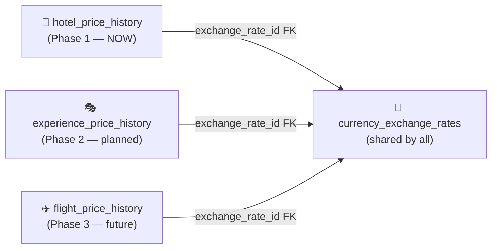
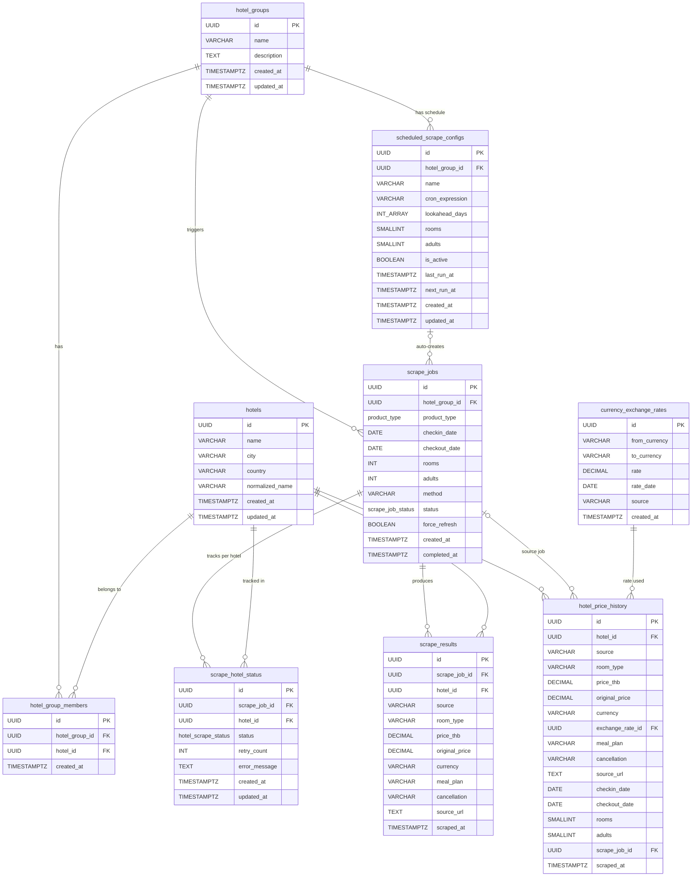

# Data Model v1.1

## What changed from v1.0

| Change | Reason |
|--------|--------|
| **`hotel_price_history`** replaces generic `price_history` | Each product type has different fields — a single polymorphic table creates too many NULLs and can't enforce proper constraints. See [[ADR-002-price-history-schema]] |
| **`currency_exchange_rates`** table added | Exchange rates change daily. We must store the exact rate used at scrape time, not today's rate, for accurate historical analysis |
| `product_type` enum kept but scoped to `scrape_jobs` only | Tells the job queue what kind of scrape this is; each product's history is its own table |
| `scheduled_scrape_configs` added | Automated cron-based scraping — [[REQ-002-v1.0]] |
| Future: `experience_price_history`, `flight_price_history` | Follow the same pattern as `hotel_price_history` — added in Phase 2/3, not now |

---

## Design Principle: One History Table Per Product Type



> [!NOTE]
> Each product type has its own history table with fields that are meaningful for that product. No NULLs from mismatched fields (e.g., `room_type` is meaningless for a flight). `currency_exchange_rates` is shared because currency conversion is product-agnostic.

---

## Enums

### scrape_job_status
`pending` | `processing` | `completed` | `failed` | `cancelled`

### hotel_scrape_status
`pending` | `processing` | `success` | `failed`

### product_type
```sql
CREATE TYPE product_type AS ENUM ('hotel', 'experience', 'flight');
```
Used on `scrape_jobs.product_type` to indicate what kind of job this is.

---

## Entities — Existing (unchanged from v1.0)

All six v1.0 tables are unchanged. See [[data-model]] for full field definitions:
- `hotel_groups`
- `hotels`
- `hotel_group_members`
- `scrape_jobs` _(+ `product_type` column added — see below)_
- `scrape_hotel_status`
- `scrape_results`

### scrape_jobs — additive change
One new column added to v1.0 `scrape_jobs`:

| Field | Type | Required | Description |
|-------|------|----------|-------------|
| product_type | product_type | Yes | `hotel` (default), `experience`, `flight` — tells the worker which scraper and history table to use |

---

## Entities — New in v1.1

### currency_exchange_rates
_Stores the exchange rate for each currency on each day. Used to convert original prices to THB at the time of scraping._

| Field | Type | Required | Description |
|-------|------|----------|-------------|
| id | UUID | Yes | Primary key |
| from_currency | VARCHAR(10) | Yes | Source currency (e.g., `USD`, `EUR`, `JPY`, `SGD`) |
| to_currency | VARCHAR(10) | Yes | Target currency — always `THB` for now |
| rate | DECIMAL(18,6) | Yes | 1 unit of `from_currency` = `rate` THB |
| rate_date | DATE | Yes | The calendar date this rate applies to |
| source | VARCHAR(50) | Yes | Where rate came from: `BOT`, `exchangerate-api`, `manual`, `fallback` |
| created_at | TIMESTAMPTZ | Yes | Auto-set |

**Constraints:**
```sql
UNIQUE (from_currency, to_currency, rate_date)
```

**Special cases:**
- `THB → THB`: rate = 1.0 (stored explicitly to simplify worker logic — always look up, never special-case)
- `fallback`: if today's rate is not yet available, use the most recent available rate and mark source as `fallback`

**Indexes:**
```sql
-- Primary lookup: "what was the USD→THB rate on this date?"
CREATE INDEX idx_cer_currencies_date ON currency_exchange_rates (from_currency, to_currency, rate_date DESC);
```

---

### hotel_price_history
_Persistent, append-only, time-series price store for hotels. Partitioned by `scraped_at` month._

| Field | Type | Required | Description |
|-------|------|----------|-------------|
| id | UUID | Yes | Primary key |
| hotel_id | UUID | Yes | FK → hotels(id) — direct, type-safe reference |
| source | VARCHAR(50) | Yes | OTA identifier: `agoda`, `booking`, `gother`, `trip.com`, `official`, etc. |
| room_type | VARCHAR(255) | Yes | Normalized room type label |
| price_thb | DECIMAL(12,2) | Yes | Price converted to THB using `exchange_rate_id` rate |
| original_price | DECIMAL(12,2) | Yes | Price in original currency (always store this for auditability) |
| currency | VARCHAR(10) | Yes | Original currency code |
| exchange_rate_id | UUID | Yes | FK → currency_exchange_rates(id) — the exact rate used to convert |
| meal_plan | VARCHAR(100) | No | Normalized meal plan label (e.g., `Room Only`, `Breakfast Included`) |
| cancellation | VARCHAR(255) | No | Cancellation policy string |
| source_url | TEXT | No | Evidence: deep link to OTA listing |
| checkin_date | DATE | Yes | Check-in date searched |
| checkout_date | DATE | Yes | Check-out date searched |
| rooms | SMALLINT | Yes | Number of rooms searched |
| adults | SMALLINT | Yes | Number of adults searched |
| scrape_job_id | UUID | No | FK → scrape_jobs(id) — nullable; links to originating job |
| scraped_at | TIMESTAMPTZ | Yes | When this price was fetched — **partition key** |

**Why `exchange_rate_id` and not just storing the rate inline?**
- Auditable: you can see exactly which source provided the rate
- Correctable: if a bad rate was stored, all affected rows can be identified and recalculated
- DRY: many prices scraped on the same day share the same rate record

**Partitioning:**
```sql
CREATE TABLE hotel_price_history (
    ...
) PARTITION BY RANGE (scraped_at);

CREATE TABLE hotel_price_history_2026_04
    PARTITION OF hotel_price_history
    FOR VALUES FROM ('2026-04-01') TO ('2026-05-01');

CREATE TABLE hotel_price_history_2026_05
    PARTITION OF hotel_price_history
    FOR VALUES FROM ('2026-05-01') TO ('2026-06-01');
```

> [!NOTE]
> New partitions must be pre-created before the month starts. Use `pg_partman` or a migration script run on the 25th of each month.

**Indexes (inherited by all partitions):**
```sql
-- "All prices for hotel X, newest first"
CREATE INDEX idx_hph_hotel_scraped    ON hotel_price_history (hotel_id, scraped_at DESC);

-- "Prices by source over time" (trend charts)
CREATE INDEX idx_hph_source_scraped   ON hotel_price_history (source, scraped_at DESC);

-- "Prices for a specific check-in date" (lookahead analysis)
CREATE INDEX idx_hph_hotel_checkin    ON hotel_price_history (hotel_id, checkin_date);

-- "Latest Gother vs OTA per hotel per check-in" (dashboard)
CREATE INDEX idx_hph_hotel_src_chkin  ON hotel_price_history (hotel_id, source, checkin_date, scraped_at DESC);
```

---

### scheduled_scrape_configs
_Defines automated scraping schedules per hotel group._

| Field | Type | Required | Description |
|-------|------|----------|-------------|
| id | UUID | Yes | Primary key |
| hotel_group_id | UUID | Yes | FK → hotel_groups(id) CASCADE DELETE |
| name | VARCHAR(100) | No | Human-readable label (e.g., "Daily Bangkok Hotels") |
| cron_expression | VARCHAR(50) | Yes | Standard 5-field cron: `0 2 * * *` = 2 AM daily |
| lookahead_days | INTEGER[] | Yes | Day offsets to scrape, e.g., `[30, 60, 90]` |
| los_variants | INTEGER[] | Yes | Length-of-stay variants to scrape per lookahead, e.g., `[1, 2, 3, 5, 7]`; default `[1]` |
| rooms | SMALLINT | Yes | Default rooms for auto-generated jobs (default 1) |
| adults | SMALLINT | Yes | Default adults for auto-generated jobs (default 2) |
| is_active | BOOLEAN | Yes | Whether this config fires automatically (default true) |
| last_run_at | TIMESTAMPTZ | No | Timestamp of last successful run |
| next_run_at | TIMESTAMPTZ | No | Computed next scheduled run (for UI display) |
| created_at | TIMESTAMPTZ | Yes | Auto-set |
| updated_at | TIMESTAMPTZ | Yes | Auto-updated |

**Example:**
```
cron_expression = "0 2 * * *"
lookahead_days  = [30, 60, 90]
los_variants    = [1, 2, 3]
→ At 2 AM daily, creates 9 scrape jobs (3 lookaheads × 3 LOS):
    checkin=today+30 / LOS=1, LOS=2, LOS=3
    checkin=today+60 / LOS=1, LOS=2, LOS=3
    checkin=today+90 / LOS=1, LOS=2, LOS=3
```

---

## Future Tables (not implemented — Phase 2 / 3)

Following the same pattern as `hotel_price_history`:

### experience_price_history _(Phase 2)_
| Field | Notes |
|-------|-------|
| experience_id | FK → experiences(id) |
| source | `klook`, `viator`, `getyourguide`, `gother` |
| activity_name | Normalized activity/tour name |
| price_thb, original_price, currency, exchange_rate_id | Same pattern as hotel_price_history |
| activity_date | Date of the experience |
| adults, children | Guest breakdown |
| duration_hours | Length of experience |
| inclusions | What's included (meals, transport, etc.) |
| source_url, scraped_at | Evidence + partition key |

### experience_availability _(Phase 2)_
_Availability snapshots per experience per time slot. Separate from price — availability changes faster and can be queried independently._

| Field | Notes |
|-------|-------|
| id | UUID PK |
| experience_id | FK → experiences(id) |
| source | `klook`, `viator`, `getyourguide`, `gother` |
| activity_date | DATE — date of the activity |
| time_slot | TIME — start time of slot (nullable for all-day experiences) |
| slots_remaining | INTEGER — capacity left; null = unknown; 0 = sold out |
| is_available | BOOLEAN — quick bookable flag |
| source_url | TEXT — deep link to OTA listing for this slot |
| scraped_at | TIMESTAMPTZ — partition key |

> [!NOTE]
> **Hotel and flight availability is implicit** — if a price is returned by the scraper, the product is available. No separate availability table is needed for hotels or flights.

### flight_price_history _(Phase 3)_
| Field | Notes |
|-------|-------|
| route_id | FK → flight_routes(id) (origin → destination) |
| source | `google_flights`, `skyscanner`, `gother` |
| airline | Airline name |
| price_thb, original_price, currency, exchange_rate_id | Same pattern |
| departure_date | Outbound date |
| return_date | Return date (null for one-way) |
| cabin_class | `economy`, `business`, `first` |
| adults, children | Passenger count |
| source_url, scraped_at | Evidence + partition key |

---

## Relationships (full, v1.1)

```
hotel_groups ──< hotel_group_members >── hotels
hotel_groups ──< scrape_jobs
hotel_groups ──< scheduled_scrape_configs

scrape_jobs ──< scrape_hotel_status
scrape_jobs ──< scrape_results
scrape_jobs ──< hotel_price_history (via scrape_job_id, nullable)

hotels ──< scrape_hotel_status
hotels ──< scrape_results
hotels ──< hotel_price_history (direct FK hotel_id)

hotel_price_history >── currency_exchange_rates (exchange_rate_id)

[Phase 2]
experience_groups ──< experience_group_members >── experiences
experiences ──< experience_price_history
experience_price_history >── currency_exchange_rates

[Phase 3]
flight_routes ──< flight_price_history
flight_price_history >── currency_exchange_rates
```

---

## Entity Relationship Diagram



---

## Materialized Views Plan

Refreshed after each scheduled scrape run. Source table is now `hotel_price_history`.

### mv_hotel_market_position
```sql
-- Latest price per (hotel, source) — market position dashboard
SELECT DISTINCT ON (hotel_id, source)
    hotel_id,
    source,
    room_type,
    price_thb,
    checkin_date,
    scraped_at
FROM hotel_price_history
ORDER BY hotel_id, source, scraped_at DESC;
```

### mv_hotel_daily_avg_price
```sql
-- Daily average price per (hotel, source) — trend charts
SELECT
    hotel_id,
    source,
    DATE_TRUNC('day', scraped_at)::DATE AS day,
    AVG(price_thb)   AS avg_price_thb,
    MIN(price_thb)   AS min_price_thb,
    MAX(price_thb)   AS max_price_thb,
    COUNT(*)         AS sample_count
FROM hotel_price_history
GROUP BY hotel_id, source, DATE_TRUNC('day', scraped_at);
```

### mv_hotel_win_rate
```sql
-- % of daily checks where Gother was cheapest per hotel
WITH daily_best AS (
    SELECT
        hotel_id,
        DATE_TRUNC('day', scraped_at)::DATE AS day,
        MIN(price_thb) AS best_price
    FROM hotel_price_history
    GROUP BY hotel_id, day
),
gother_daily AS (
    SELECT DISTINCT ON (hotel_id, DATE_TRUNC('day', scraped_at))
        hotel_id,
        DATE_TRUNC('day', scraped_at)::DATE AS day,
        price_thb AS gother_price
    FROM hotel_price_history
    WHERE source = 'gother'
    ORDER BY hotel_id, day, scraped_at DESC
)
SELECT
    g.hotel_id,
    COUNT(*) AS total_days,
    SUM(CASE WHEN g.gother_price <= d.best_price THEN 1 ELSE 0 END) AS winning_days,
    ROUND(100.0 * SUM(CASE WHEN g.gother_price <= d.best_price THEN 1 ELSE 0 END) / COUNT(*), 1) AS win_rate_pct
FROM gother_daily g
JOIN daily_best d ON g.hotel_id = d.hotel_id AND g.day = d.day
GROUP BY g.hotel_id;
```

### mv_hotel_booking_window
```sql
-- Average price by days-in-advance per (hotel, source) — booking window chart
SELECT
    hotel_id,
    source,
    checkin_date - DATE(scraped_at)   AS days_in_advance,
    AVG(price_thb)                    AS avg_price_thb,
    MIN(price_thb)                    AS min_price_thb,
    COUNT(*)                          AS sample_count
FROM hotel_price_history
GROUP BY hotel_id, source, days_in_advance
ORDER BY hotel_id, source, days_in_advance;
```

### mv_hotel_parity_violations
```sql
-- Hotels where Gother is more expensive than the best OTA (latest prices)
WITH latest AS (
    SELECT DISTINCT ON (hotel_id, source)
        hotel_id, source, price_thb, checkin_date, scraped_at
    FROM hotel_price_history
    ORDER BY hotel_id, source, scraped_at DESC
),
gother AS (
    SELECT hotel_id, price_thb AS gother_price, checkin_date
    FROM latest WHERE source = 'gother'
),
best_ota AS (
    SELECT hotel_id, MIN(price_thb) AS best_ota_price
    FROM latest WHERE source != 'gother'
    GROUP BY hotel_id
)
SELECT
    g.hotel_id,
    g.gother_price,
    b.best_ota_price,
    ROUND(100.0 * (g.gother_price - b.best_ota_price) / b.best_ota_price, 1) AS gap_pct
FROM gother g
JOIN best_ota b ON g.hotel_id = b.hotel_id
WHERE g.gother_price > b.best_ota_price;
-- Filter in app: WHERE gap_pct > :threshold (default 5.0)
```

---

## Migration Plan

All changes are **additive** — no existing v1.0 tables are modified except `scrape_jobs` (one new column).

| # | Migration File | Description |
|---|---------------|-------------|
| 007 | `007_add_product_type_enum.sql` | Create `product_type` enum |
| 008 | `008_add_product_type_to_scrape_jobs.sql` | Add `product_type` column to `scrape_jobs` (default `hotel`) |
| 009 | `009_create_currency_exchange_rates.sql` | Create `currency_exchange_rates` table + unique index |
| 010 | `010_create_hotel_price_history.sql` | Create partitioned `hotel_price_history` + all indexes |
| 011 | `011_create_hotel_price_history_partitions.sql` | Create initial partitions (current month + next 3 months) |
| 012 | `012_create_scheduled_scrape_configs.sql` | Create `scheduled_scrape_configs` table |
| 013 | `013_create_materialized_views.sql` | Create `mv_hotel_market_position`, `mv_hotel_daily_avg_price`, `mv_hotel_win_rate` |

---

## Notes

> [!NOTE]
> `hotel_price_history.hotel_id` is a real FK → `hotels(id)`, unlike the old design's polymorphic `reference_id`. This enforces referential integrity and lets the query planner optimize joins properly.

> [!NOTE]
> Always look up `currency_exchange_rates` before inserting into `hotel_price_history`. If today's rate does not exist yet, fetch it from the exchange rate API, store it, then proceed. Never hard-code conversion rates in application code.

> [!WARNING]
> Never DELETE individual rows from `hotel_price_history` — DROP the entire monthly partition for retention cleanup. Row-level deletes on a large partitioned table cause table bloat and are extremely slow.

- `scrape_results` (v1.0) is kept unchanged — it serves as the job-level result store. `hotel_price_history` is the long-term analytics store. Both are written on each scrape.
- `THB → THB` rate (1.0) should be stored in `currency_exchange_rates` to keep worker logic uniform — no special-casing needed.
- The `fallback` source on `currency_exchange_rates` means: today's rate wasn't available, so the most recent known rate was used. Flag for review if accuracy matters.

---

## Change Log
| Version | Date | Change | Reason |
|---------|------|--------|--------|
| 1.0 | 2026-04-22 | Initial data model — 6 tables (hotel_groups, hotels, hotel_group_members, scrape_jobs, scrape_hotel_status, scrape_results) | Retroactive documentation of implemented schema |
| 1.1 | 2026-04-27 | Replaced generic `price_history` with `hotel_price_history` (direct hotel_id FK); added `currency_exchange_rates` (exchange_rate_id FK for auditable conversion); added `scheduled_scrape_configs`; added 7 new migrations (007–013); added materialized views (mv_hotel_market_position, mv_hotel_daily_avg_price, mv_hotel_win_rate); documented future tables (experience_price_history, flight_price_history) | Platform vision: price history, automation, analytics; ADR-002 accepted |
