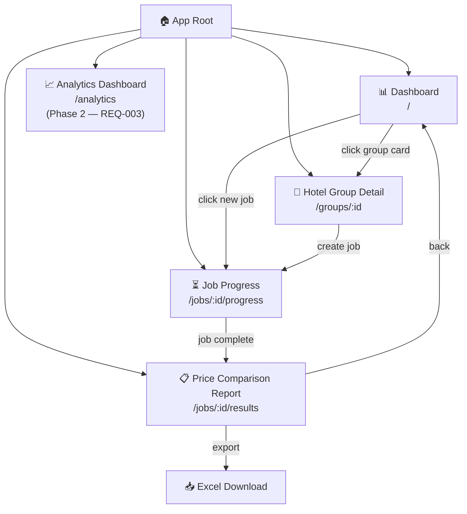
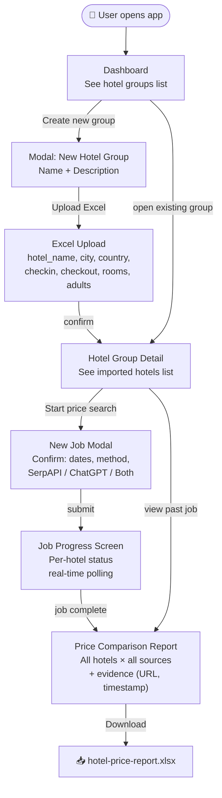
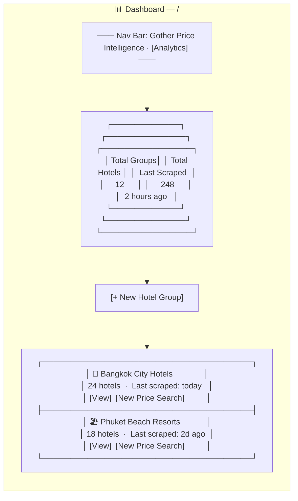
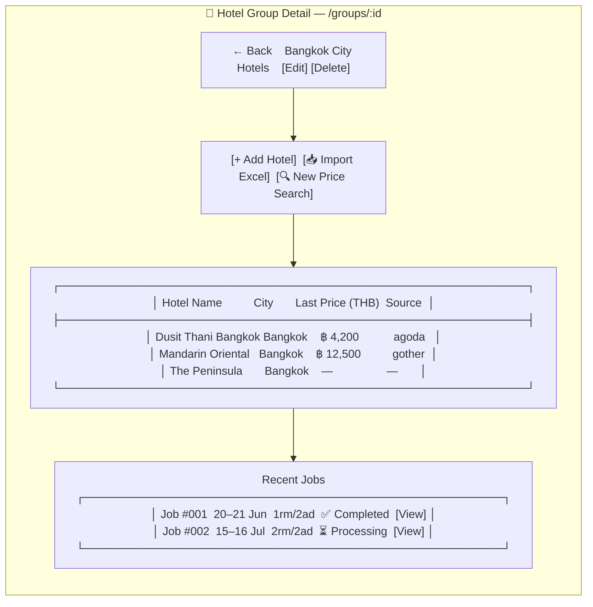
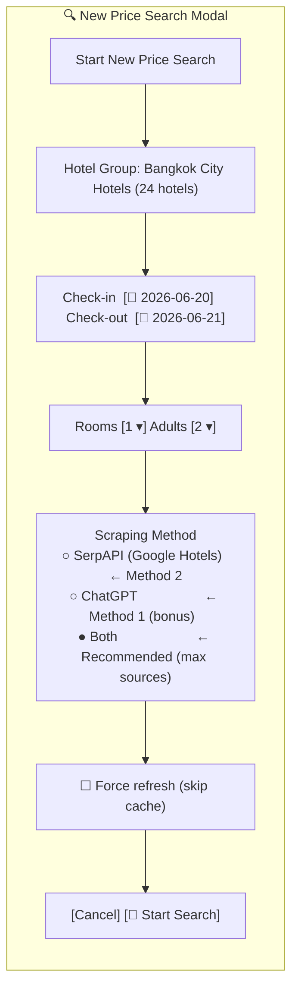
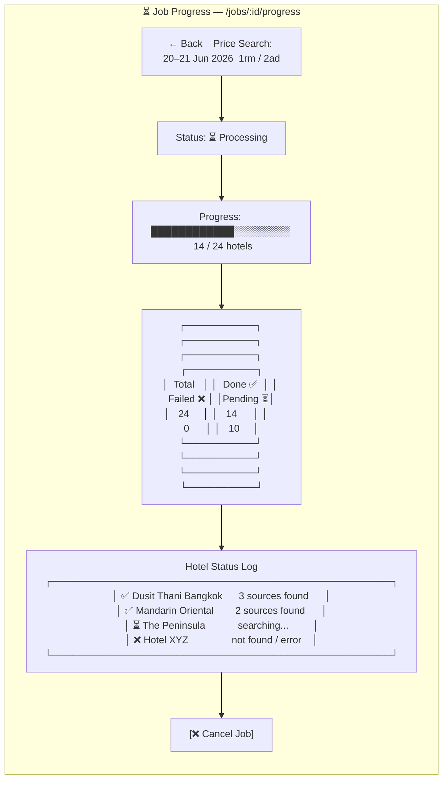
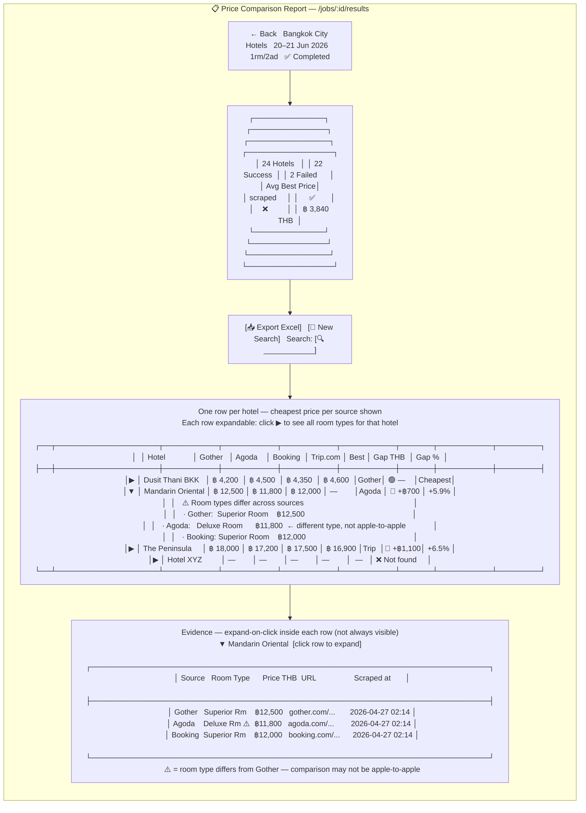
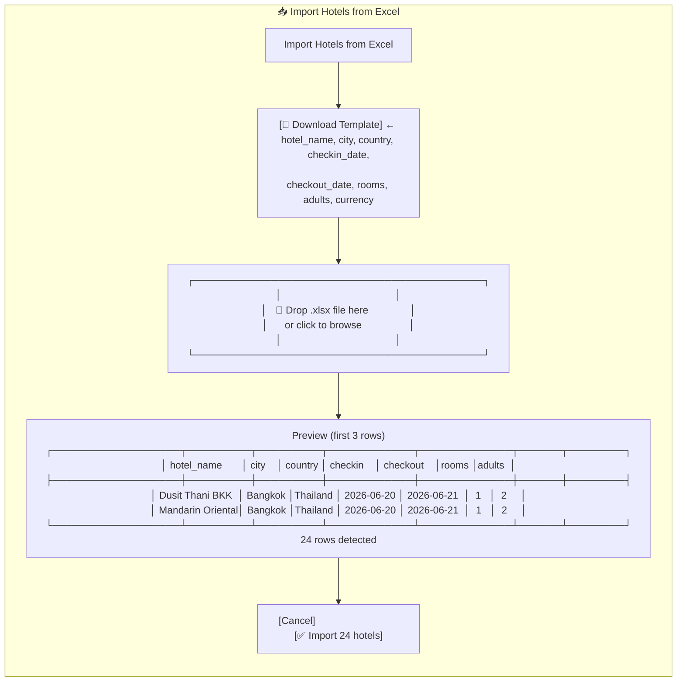
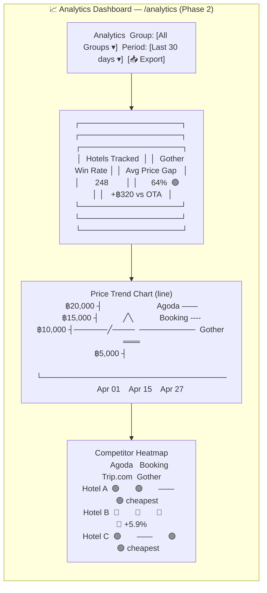

# UI Wireframes v1

## Navigation Structure



---

## User Journey — Competition Demo Flow



---

## Screen 1: Dashboard



---

## Screen 2: Hotel Group Detail



---

## Screen 3: New Job Modal



---

## Screen 4: Job Progress



---

## Screen 5: Price Comparison Report (KEY SCREEN — Judges will see this)



---

## Screen 6: Excel Import Modal



---

## Screen 7: Analytics Dashboard (Phase 2 — REQ-003)



---

## Color Coding & States

| State | Color | Meaning |
|-------|-------|---------|
| 🟢 Green | Gother is cheapest | Win |
| 🔴 Red | Gother is more expensive | Lose — action needed |
| ⚪ Grey / — | No data available | No match found |
| ⏳ Yellow | Processing | In progress |
| ❌ Red badge | Error | Scrape failed |

---

## Decisions

> [!NOTE]
> All UI open questions resolved 2026-04-27.

| Decision | Answer | UI Impact |
|----------|--------|-----------|
| Report table rows | ✅ **One row per hotel, cheapest price per source** | Row shows minimum price per OTA column. Click `▶` to expand all room types |
| Apple-to-apple mismatch | ✅ **Show ⚠️ warning badge** | Badge appears on the price cell and inside expanded detail when room types differ across sources |
| Evidence (URL + scraped_at) | ✅ **Expand-on-click** | Click anywhere on a hotel row to expand. Evidence shown inside the expanded panel per source with URL link + timestamp |
| Mobile layout | ✅ **No mobile — desktop only** | Min width: 1280px. No responsive breakpoints needed for v1 |
| Filters persist via URL params | ✅ **Yes — URL params** | `?group=uuid&period=30d&checkin=2026-06-20` etc. so users can bookmark and share filtered views |

## Row Interaction Model

```
Default (collapsed):
▶ Hotel Name │ Gother ฿ │ Agoda ฿ │ Booking ฿ │ Trip ฿ │ Best │ Gap ฿ │ Gap %

Click anywhere on row → expands:
▼ Hotel Name │ Gother ฿ │ Agoda ฿ │ Booking ฿ │ Trip ฿ │ Best │ Gap ฿ │ Gap %
  ┌─────────────────────────────────────────────────────────────┐
  │ All room types per source + URL + scraped_at timestamp      │
  │ ⚠️ badge on any price where room type ≠ Gother room type   │
  └─────────────────────────────────────────────────────────────┘
```

## Warning Badge Rule
⚠️ shown when ANY of the following differ between OTA source X and Gother:
- **Room type** — the normalized room type does not match Gother's room type
- **Meal plan** — e.g., Gother = Breakfast Included, Agoda = Room Only
- **Cancellation policy** — e.g., Gother = Free Cancellation, OTA = Non-Refundable (not apple-to-apple on value)

Tooltip on hover shows which dimension mismatched:
- "Room types differ — comparison may not be apple-to-apple"
- "Meal plan differs — Gother includes breakfast, OTA does not"
- "Cancellation policy differs — Gother is refundable, OTA is non-refundable"

## Color Coding & States

| State | Indicator | Meaning |
|-------|-----------|---------|
| 🟢 Green | Gap = Cheapest | Gother is cheapest |
| 🔴 Red | Gap +฿X (+Y%) | Gother is more expensive |
| ⚠️ Warning | Badge on cell | Room types differ across sources |
| ⚪ — | Dash | No data from this source |
| ❌ | Not found | Scrape failed for this hotel |
| ⏳ | Processing | Job still running |

## Change Log
| Version | Date | Change |
|---------|------|--------|
| 1.0 | 2026-04-27 | Initial wireframes — all 7 screens |
| 1.1 | 2026-04-27 | Closed all open questions; updated report table with expand/collapse, ⚠️ badge, evidence panel; added row interaction model, warning badge rule, URL param filter decision |
